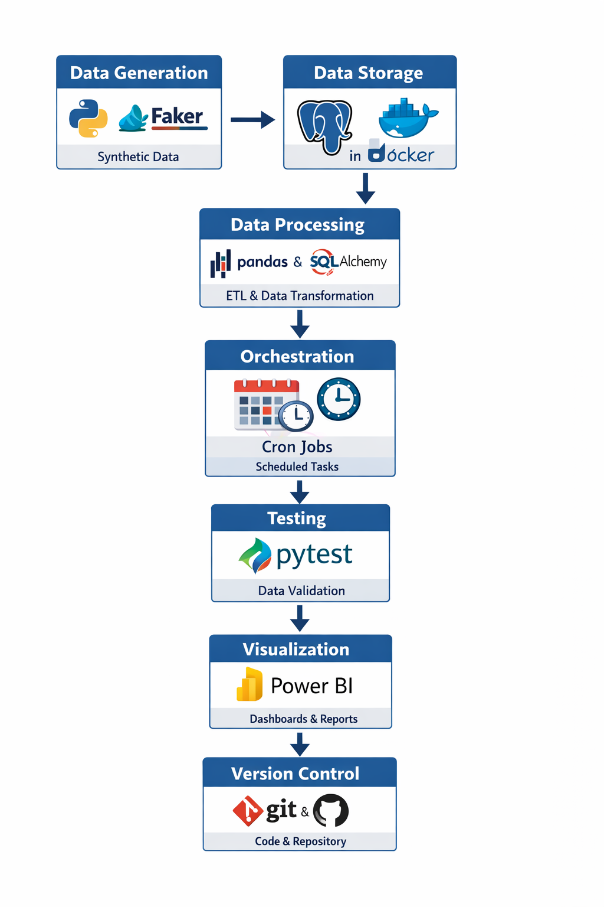

# E-Commerce Data Analytics Pipeline

## Project Overview

This project implements an end-to-end E-Commerce Data Analytics Pipeline that generates synthetic data, ingests it into PostgreSQL, processes it across staging, production, and warehouse layers, and visualizes insights using Power BI. The pipeline follows modern data engineering best practices including data generation, ingestion, transformation, orchestration, automated testing, containerization, and BI visualization.

---
##  Project Demo

A complete walkthrough of the project, including setup, features, and output demonstration.

**Watch the demo video:**  
https://drive.google.com/file/d/1yPPG_tVlobaWKBtUGHedRdYg40yaf33F/view?usp=sharing

---


## Architecture Overview

The pipeline follows a three-layer architecture designed for scalability, data quality, and analytics performance.

* **Staging Layer** – Stores raw ingested CSV data with minimal validation for auditing and recovery
* **Production Layer** – Normalized (3NF) schema ensuring data integrity and consistency
* **Warehouse Layer** – Star Schema optimized for analytical queries and BI dashboards

The warehouse uses a fact table and multiple dimension tables to support fast aggregations and reporting.

---
### Architecture Diagram

The architecture diagram is included in this repository at the following path:




---

## Project Structure

The project is organized into configuration files, dashboards, raw and processed data folders, pipeline scripts, SQL files, tests, Docker configuration, and documentation. Each directory follows a clear responsibility-based structure to ensure maintainability and scalability.

---

## Folder Structure
```
ecommerce-data-pipeline/
│
├── config/
│   └── config.yaml
│
├── dashboards/
│   ├── powerbi/
│   │   └── ecommerce_analytics.pbix
│   └── screenshots/
│
├── data/
│   ├── raw/
│   │   ├── customers.csv
│   │   ├── products.csv
│   │   ├── transactions.csv
│   │   └── transaction_items.csv
│   │
│   ├── staging/
│   │   └── ingestion_summary.json
│   │
│   └── processed/
│       ├── analytics/
│       ├── pipeline_execution_report.json
│       ├── transformation_summary.json
│       └── quality_reports/
│           └── quality_report.json
│
├── scripts/
│   ├── data_generation/
│   │   └── generate_data.py
│   │
│   ├── ingestion/
│   │   └── ingest_to_staging.py
│   │
│   ├── transformation/
│   │   ├── staging_to_production.py
│   │   └── load_warehouse.py
│   │
│   ├── quality_checks/
│   │   └── validate_data.py
│   │
│   ├── monitoring/
│   │   └── pipeline_monitor.py
│   │
│   └── orchestration/
│       └── run_pipeline.py
│
├── sql/
│   ├── ddl/
│   ├── dml/
│   └── queries/
│
├── tests/
│   ├── test_data_generation.py
│   ├── test_ingestion.py
│   ├── test_quality_checks.py
│   ├── test_transformation.py
│   └── test_warehouse.py
│
├── docs/
│   └── image/
│       └── architecture_overview.png
│
├── docker-compose.yml
├── Dockerfile
├── requirements.txt
├── pytest.ini
├── .env.example
├── .gitignore
├── README.md
└── SUBMISSION.md

```

## Code Organization

Data generation creates synthetic datasets. Ingestion loads raw CSV data into staging tables. Transformation moves data into production and warehouse schemas. Quality checks validate data accuracy and integrity. Orchestration runs the entire pipeline end-to-end. Monitoring tracks execution status and logs. SQL scripts define schemas and analytical queries. Tests ensure correctness and reliability.

---
## Configuration

Database credentials are managed using environment variables. Configuration values are centralized in config/config.yaml. Docker provides a consistent and reproducible execution environment.

---
## Prerequisites

Python 3.9
Docker and Docker Compose 
Power BI Desktop.

---

## Installation and Setup

#### GitHub Repository
```
https://github.com/Laharisrikotipalli/ecommerce-data-pipeline-23MH1A05I0
```
### Clone the repoitory
```
git clone https://github.com/Laharisrikotipalli/ecommerce-data-pipeline-23MH1A05I0
```

### Start PostgreSQL using Docker Compose
```
docker compose up -d
```

### Verify Docker containers are running
```
docker ps
```
---
## Running the Data Pipeline

### Run the complete end-to-end pipeline
```
python scripts/orchestration/run_pipeline.py
```
### Running Individual Pipeline Steps

#### Data Generation
```
python scripts/data_generation/generate_data.py
```

#### Data Ingestion (Staging Layer)
```
python scripts/ingestion/ingest_to_staging.py
```

#### Data Transformation (Staging → Production)
```
python scripts/transformation/staging_to_production.py
```

#### Warehouse Load (Star Schema)
```
python scripts/transformation/load_warehouse.py
```
---
## Testing

#### Run all tests
```
pytest
```

#### Run tests with coverage (optional)
```
pytest --cov=scripts --cov-report=term-missing
```
---

## Data Model

The staging schema mirrors raw CSV data with minimal validation. The production schema follows third normal form to reduce redundancy and enforce referential integrity. The warehouse schema follows a Star Schema with `fact_sales` as the fact table and customer, product, date, and payment dimensions. Slowly Changing Dimension Type 2 is implemented to preserve historical changes.

---
## Dashboard Access

The Power BI dashboard is available in two ways:

* **Local PBIX file:**
  dashboards/powerbi/

* **OneDrive Download Link:**
  [https://adityagroup-my.sharepoint.com/:u:/g/personal/23mh1a05i0_acoe_edu_in/IQBv4ElDQPvbRa8R_ere1HYyAVVpCkm19IaIB-JLUZA0G6g?e=j8mJbj](https://adityagroup-my.sharepoint.com/:u:/g/personal/23mh1a05i0_acoe_edu_in/IQBv4ElDQPvbRa8R_ere1HYyAVVpCkm19IaIB-JLUZA0G6g?e=j8mJbj)

To view the dashboard:

1. Open Power BI Desktop
2. Open the PBIX file
3. Click **Refresh** to load the latest data

---

## Dashboard Pages

The Executive Summary page provides high-level metrics such as revenue, orders, average order value, profit margin, and trends. The Product Analysis page shows product and category performance. The Customer Insights page presents customer segmentation and distribution. The Geographic and Trends page displays state-wise revenue and time-based trends.

---

## Metric Definitions

Total Revenue is calculated as quantity multiplied by unit price minus discount. Average Order Value is calculated as total revenue divided by total orders. Profit Margin is calculated as profit divided by total revenue. Customer Lifetime Value is derived from average order value, purchase frequency, and customer lifespan.

---

## Declaration

I hereby declare that this project titled **E-Commerce Data Analytics Pipeline** is my original work completed independently for academic purposes.

**Name**: Lahari Sri Kotipalli

**Roll Number:** 23MH1A05I0

**Email:** laharisrikotipalli07@gmail.com (mailto:laharisrikotipalli07@gmail.com)

**Submission Date:** 25-12-2025
